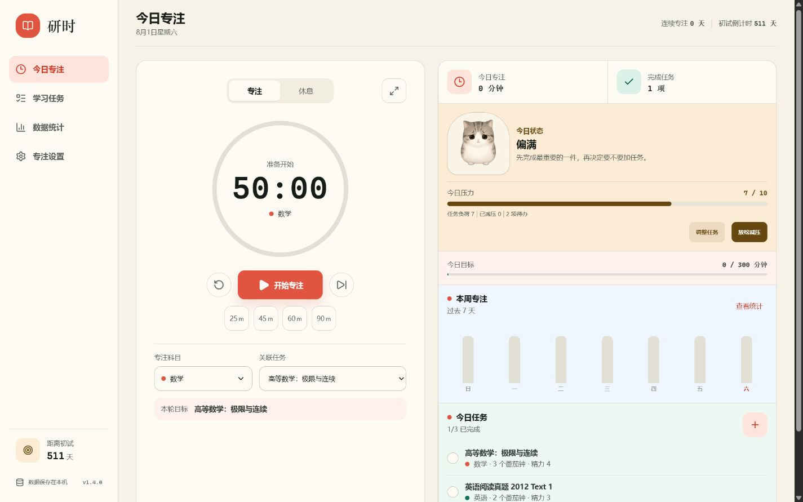
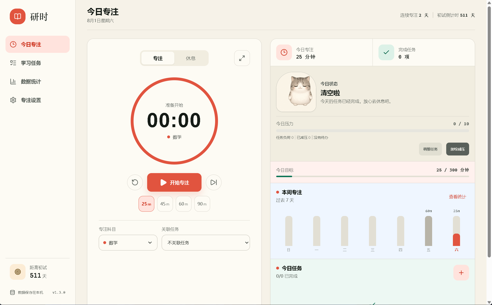
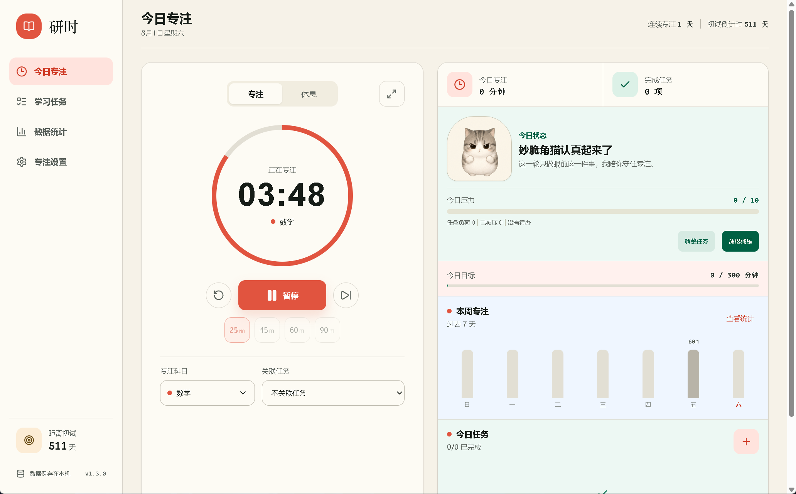
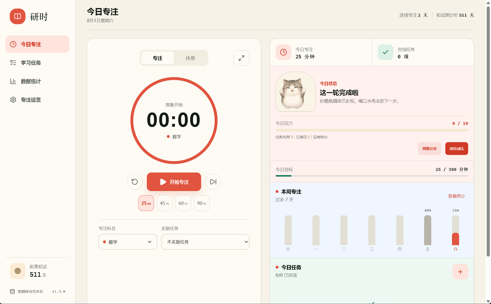
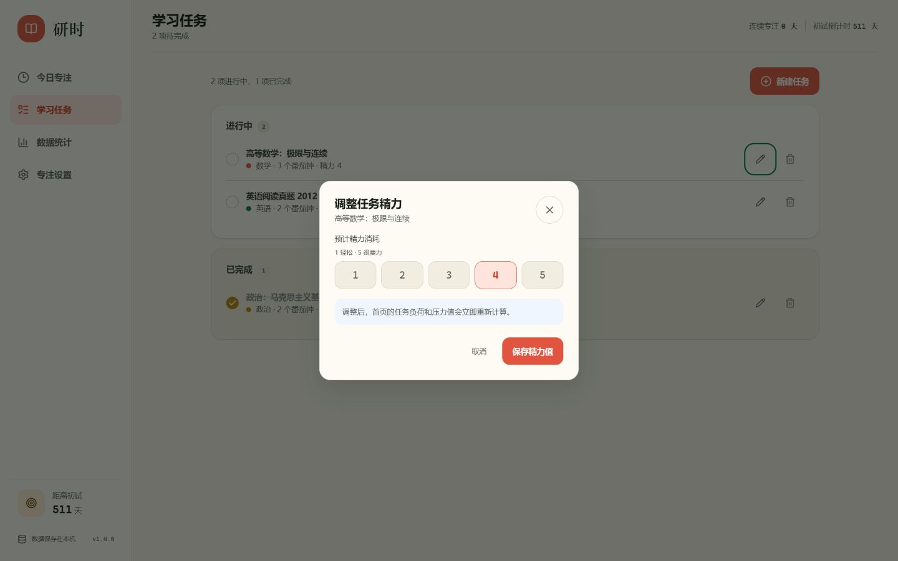
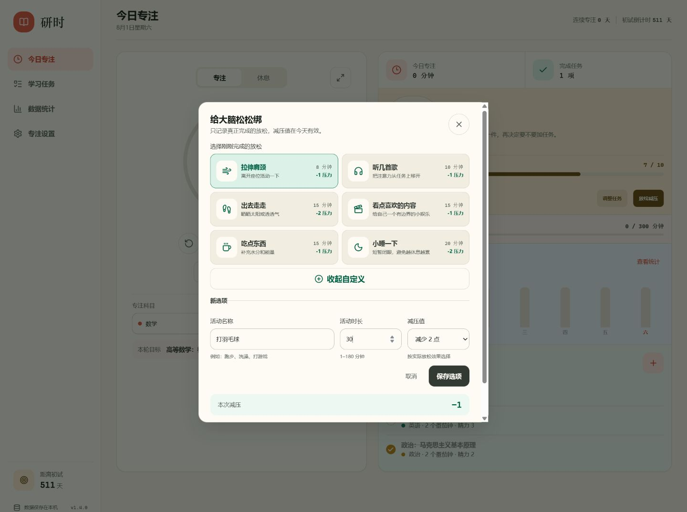
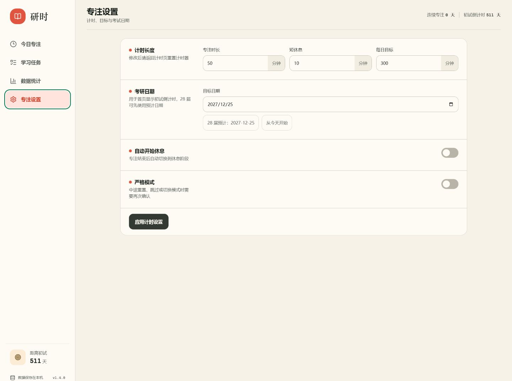
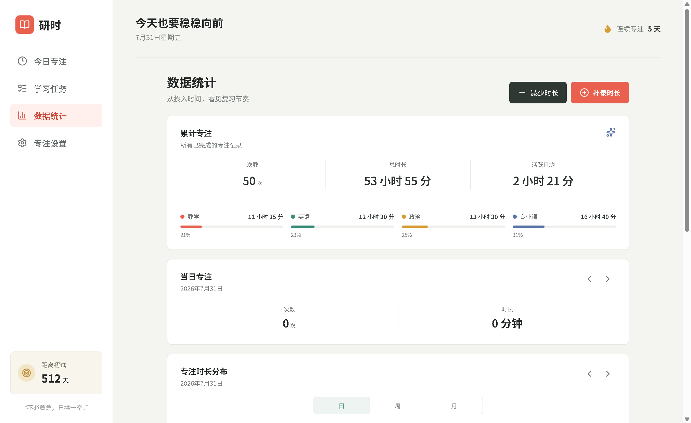

# 研时 · 考研专注与压力管理

> 一款为考研复习设计的 Windows 桌面工具。把专注计时、学习任务、精力负荷、真实放松与妙脆角猫陪伴放在同一个安静的学习空间里。




## 研时想解决什么

普通番茄钟只记录“学了多久”，研时还关心“今天还能学多少”。

未完成任务的精力值会形成当日任务负荷，专注、完成任务和真实放松会共同改变压力状态。妙脆角猫会根据这些学习事件切换表情与文案，让反馈来自真实进度，而不是随机动画。

所有任务、专注记录、设置和自定义放松选项都优先保存在本机，不需要注册账号。

## v1.4.0 新变化

| 更新 | 说明 |
|---|---|
| 妙脆角猫陪伴 | 根据专注、暂停、任务完成和放松记录改变表情与提示文案 |
| 任务精力可编辑 | 每项任务可设置 1–5 级精力值，首页压力随任务负荷实时变化 |
| 放松减压 | 内置拉伸、听歌、散步、限时娱乐、补充能量和小睡等选项 |
| 自定义放松 | 自定义活动名称、时长和减压值，选项会保存在本机 |
| 减压记录 | 查看今日每次放松，可逐条撤销并在 10 秒内恢复 |
| 删除可撤销 | 删除自定义放松后，可在 10 秒内撤销 |

## 妙脆角猫会回应真实学习事件

妙脆角猫不是随机更换表情。任务清空、专注进行中和完成一轮专注，都会触发对应的状态与鼓励文案。

### 任务清空：放心休息



### 正在专注：认真陪伴



### 完成一轮：即时庆祝



## 主要体验

### 任务不只算数量，也计算精力

不同任务消耗不同。研时允许单独调整每项任务的精力值，并立即更新首页的任务负荷和压力值。



### 只有真正完成的放松才会减压

选择刚刚完成的放松活动，或创建自己的减压方式。活动时长用于记录，减压值只在当天生效。



### 专注节奏和考研日期都可以自己决定

支持自定义专注时长、短休息、每日目标、考研日期、自动开始休息与严格模式。



### 统计数据可以补录，也可以修正

累计次数、总时长、活跃日均、科目分布和每日图表都来自同一份专注记录。补录、减少、编辑或删除记录后，所有统计会同步更新。



> 统计页截图使用演示数据，不包含真实用户记录。

## 功能清单

### 专注计时

- 专注与休息双模式
- 25、45、60、90 分钟快捷时长
- 暂停、重置、跳过和自动开始休息
- 全屏沉浸式专注页面
- 严格模式，减少中途退出和切换
- 计时期间阻止系统休眠
- 应用重启后按目标结束时间恢复剩余时长

### 任务与压力

- 数学、英语、政治、专业课四类内置科目
- 新建、完成和删除学习任务
- 设置预计番茄钟数量
- 每项任务设置 1–5 级精力值
- 根据未完成任务计算当日任务负荷
- 专注记录可关联具体任务

### 放松与陪伴

- 六种内置放松选项
- 自定义活动名称、时长和 1–3 点减压值
- 自定义选项本机持久化
- 查看今日减压记录，逐条撤销并在 10 秒内恢复
- 删除自定义选项后 10 秒内撤销
- 妙脆角猫根据真实学习事件切换状态

### 倒计时与统计

- 自定义考研初试目标日期
- 提供 28 届预计日期快捷设置
- 日、周、月三个统计周期
- 科目时长分布与每日专注图表
- 支持补录、减少、编辑和删除专注记录

## 下载安装

### 普通用户

1. 前往 [GitHub Releases](https://github.com/yhlyhl666/yanshi-focus/releases) 下载最新版 Windows 安装包。
2. 双击 `Yanshi-Setup-1.4.0.exe`，选择安装目录。
3. 安装完成后，从桌面快捷方式启动“研时”。

目前支持 Windows 10/11 x64。项目暂未购买代码签名证书，因此 Windows SmartScreen 可能显示“未知发布者”提示。

### 本地开发

环境要求：Node.js 20+、npm、Windows。

```bash
npm install
npm run desktop:dev
```

构建前端：

```bash
npm run build
```

生成 Windows 安装包：

```bash
npm run desktop:dist
```

安装包会生成在 `release/` 目录。

## 数据与隐私

- 任务、设置、专注记录、减压记录、自定义放松和计时恢复状态保存在当前电脑。
- 当前版本没有账号系统、广告、统计 SDK 和云同步。
- 覆盖安装通常不会删除本地数据。
- 卸载、系统清理或更换电脑前，请备份 Electron 用户数据目录；后续版本计划加入数据导出与导入。

## 技术架构

```text
Electron Main Process
├── BrowserWindow 桌面窗口
├── 单实例启动与窗口尺寸记忆
├── powerSaveBlocker 防止专注期间休眠
└── file:// 加载 Vite 构建产物

Preload Bridge
└── contextBridge 暴露最小化 IPC 能力

React Renderer
├── 今日专注与计时恢复
├── 学习任务与任务精力
├── 压力计算与自定义放松
├── 妙脆角猫事件状态
├── 数据统计与记录修正
├── 专注设置与考研倒计时
└── localStorage 本地持久化
```

| 模块 | 技术 |
|---|---|
| UI | React 19、CSS、lucide-react |
| 构建 | Vite 8 |
| 桌面端 | Electron 43 |
| 安装包 | Electron Builder、NSIS |
| 数据 | localStorage，本地优先 |
| 图表 | 原生 SVG、CSS Grid |

## 项目结构

```text
研时/
├── electron/          # Electron 主进程与安全桥接
├── mobile/            # Expo 移动端原型
├── scripts/           # 构建、图标与桌面验收脚本
├── src/
│   ├── assets/        # 妙脆角猫与沉浸模式资源
│   ├── App.jsx        # 主要业务逻辑与界面
│   ├── main.jsx       # React 入口
│   └── styles.css     # 界面样式
├── docs/images/       # README 展示图片
├── tokens.css         # 设计变量
├── package.json
└── vite.config.js
```

## 质量检查

```bash
npm run build
npm run desktop:check
```

当前 v1.4.0 已完成桌面端构建检查、自定义减压完整交互验证，以及 320px 手机宽度的响应式检查。

## 后续计划

- [ ] 数据导出、导入与自动备份
- [ ] 从 localStorage 迁移到 SQLite
- [ ] 自定义科目与科目颜色
- [ ] 周目标、月目标和复习阶段计划
- [ ] 完善移动端版本
- [ ] 单元测试和更多桌面端交互测试

## 许可证

本项目使用 [MIT License](LICENSE)。

---

> 不必着急，日拱一卒。
